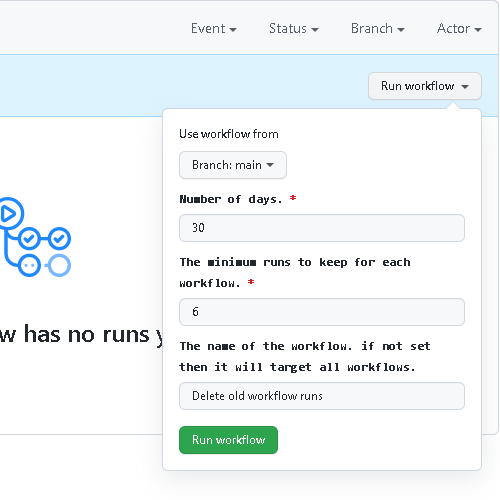

# delete-workflow-runs v2
The GitHub action to delete workflow runs in a repository. This action (written in JavaScript) wraps two Workflow Runs API:
* [**List repository workflows**](https://docs.github.com/en/free-pro-team@latest/rest/reference/actions#list-repository-workflows) -- Lists the workflows in a repository.

* [**List workflow runs**](https://docs.github.com/en/free-pro-team@latest/rest/reference/actions#list-workflow-runs) -- List all workflow runs for a workflow.

* [**Delete a workflow run**](https://docs.github.com/en/free-pro-team@latest/rest/reference/actions#delete-a-workflow-run) -- Delete a specific workflow run.

The action will calculate the number of days that each workflow run has been retained so far, then use this number to compare with the number you specify for the input parameter "[**`retain_days`**](#3-retain_days)". If the retention days of the workflow run has reached (equal to or greater than) the specified number, the workflow run will be deleted.

## What's new?
* Added ability to match multiple values with "[**`delete_workflow_by_state_pattern`**](#6-delete_workflow_by_state_pattern)" & "[**`delete_run_by_conclusion_pattern`**](#7-delete_run_by_conclusion_pattern)" by using a comma-separated list
* Removed 'all' option from "[**`delete_workflow_pattern`**](#5-delete_workflow_pattern)", simply don't provide it a value for all workflows to be targeted
* Added the input parameter "[**`delete_run_by_conclusion_pattern`**](#7-delete_run_by_conclusion_pattern)" - filters runs by conclusion (useful for `skipped`!)
* Added the input parameter "[**`delete_workflow_by_state_pattern`**](#6-delete_workflow_by_state_pattern)" - filters workflows by state
* Added the input parameter "[**`dry_run`**](#8-dry_run)" - only logs targeted workflows & runs, no deletions are performed
* Added ability to filter workflows by workflow filename (in addition to the name)
##

## Inputs
### 1. `token`
#### Required: YES
#### Default: `${{ github.token }}`
The token used to authenticate.
* If the workflow runs are in the current repository where the action is running, using **`github.token`** is OK, but you must specify additional permissions within your build job (or at a higher level) to allow the default token access to read the repository contents and to write (delete) action-related data, see the examples below. More details, see the [**`GITHUB_TOKEN`**](https://docs.github.com/en/free-pro-team@latest/actions/reference/authentication-in-a-workflow).
* If the workflow runs are in another repository, you need to use a personal access token (PAT) that must have the **`repo`** scope. More details, see "[Creating a personal access token](https://docs.github.com/en/free-pro-team@latest/github/authenticating-to-github/creating-a-personal-access-token)".

### 2. `repository`
#### Required: YES
#### Default: `${{ github.repository }}`
Name of the repository where the workflow runs are located

### 3. `retain_days`
#### Required: YES
#### Default: 30
Amount of days used to compare with the retention days of each workflow

### 4. `keep_minimum_runs`
#### Required: YES
#### Default: 6
Minimum runs to keep for each workflow

### 5. `delete_workflow_pattern`
#### Required: NO
Name or filename of the workflow (if not set, all workflows are targeted)

### 6. `delete_workflow_by_state_pattern`
#### Required: NO
#### Default: 'ALL'
Filter workflows by state: active, deleted, disabled_fork, disabled_inactivity, disabled_manually  
_Multiple state values permitted as a comma-separated list_

### 7. `delete_run_by_conclusion_pattern`
#### Required: NO
#### Default: 'ALL'
Remove runs based on conclusion: action_required, cancelled, failure, skipped, success  
_Multiple conclusion values permitted as a comma-separated list_

### 8. `dry_run`
#### Required: NO
Logs simulated changes, no deletions are performed
##

### 9. `check_branch_existence`
#### Required: NO
If true, the removage of a workflow is skipped, when a run is attached to a existing branch. Set to true avoids that check runs are deleted and the checks are not more present. (excludes main)
##

### 10. `check_pullrequest_exist`
#### Required: NO
If true, the Runs will be checked for linkage to a PR.
##


## Examples
### In scheduled workflow, see [schedule event](https://docs.github.com/en/free-pro-team@latest/actions/reference/events-that-trigger-workflows#schedule).
> **Tip:** Using scheduled workflow is the recommended way that can periodically, automatically delete old workflow runs.
```yaml
name: Delete old workflow runs
on:
  schedule:
    - cron: '0 0 1 * *'
# Run monthly, at 00:00 on the 1st day of month.

jobs:
  del_runs:
    runs-on: ubuntu-latest
    permissions:
      actions: write
      contents: read
    steps:
      - name: Delete workflow runs
        uses: Mattraks/delete-workflow-runs@v2
        with:
          token: ${{ github.token }}
          repository: ${{ github.repository }}
          retain_days: 30
          keep_minimum_runs: 6
```

### In manual triggered workflow, see [workflow_dispatch event](https://docs.github.com/en/free-pro-team@latest/actions/reference/events-that-trigger-workflows#workflow_dispatch).
> In this way, you can manually trigger the workflow at any time to delete old workflow runs. <br/>

```yaml
name: Delete old workflow runs
on:
  workflow_dispatch:
    inputs:
      days:
        description: 'Days-worth of runs to keep for each workflow'
        required: true
        default: '30'
      minimum_runs:
        description: 'Minimum runs to keep for each workflow'
        required: true
        default: '6'
      delete_workflow_pattern:
        description: 'Name or filename of the workflow (if not set, all workflows are targeted)'
        required: false
      delete_workflow_by_state_pattern:
        description: 'Filter workflows by state: active, deleted, disabled_fork, disabled_inactivity, disabled_manually'
        required: true
        default: "ALL"
        type: choice
        options:
          - "ALL"
          - active
          - deleted
          - disabled_inactivity
          - disabled_manually
      delete_run_by_conclusion_pattern:
        description: 'Remove runs based on conclusion: action_required, cancelled, failure, skipped, success'
        required: true
        default: "ALL"
        type: choice
        options:
          - "ALL"
          - "Unsuccessful: action_required,cancelled,failure,skipped"
          - action_required
          - cancelled
          - failure
          - skipped
          - success
      dry_run:
        description: 'Logs simulated changes, no deletions are performed'
        required: false

jobs:
  del_runs:
    runs-on: ubuntu-latest
    permissions:
      actions: write
      contents: read
    steps:
      - name: Delete workflow runs
        uses: Mattraks/delete-workflow-runs@v2
        with:
          token: ${{ github.token }}
          repository: ${{ github.repository }}
          retain_days: ${{ github.event.inputs.days }}
          keep_minimum_runs: ${{ github.event.inputs.minimum_runs }}
          delete_workflow_pattern: ${{ github.event.inputs.delete_workflow_pattern }}
          delete_workflow_by_state_pattern: ${{ github.event.inputs.delete_workflow_by_state_pattern }}
          delete_run_by_conclusion_pattern: >-
            ${{
              startsWith(github.event.inputs.delete_run_by_conclusion_pattern, 'Unsuccessful:')
              && 'action_required,cancelled,failure,skipped'
              || github.event.inputs.delete_run_by_conclusion_pattern
            }}
          dry_run: ${{ github.event.inputs.dry_run }}
```

### Using with self-hosted git hub enterprise

If you're using this action in a GHE environment, the value you provide for `baseUrl` needs to be the precise and full URL.
Consult the [documentation](https://docs.github.com/en/enterprise-server@3.14/rest/quickstart?apiVersion=2022-11-28) for your GHE instance to determine the correct URL to use.

For this example, let's say that you're running a modern version of GHE and it is accessible at `https://github.mycompany.com`.
The API endpoint for your GHE instance will (probably) be `https://github.mycompany.com/api/v3`.
So the resulting configuration would look like this:

```yaml
jobs:
    clean_up:
        # <...>
        steps:
            - name: Delete workflow runs
              uses: Mattraks/delete-workflow-runs@v2
              with:
                  # <...>
                  baseUrl: https://github.mycompany.com/api/v3
```

##

## License
The scripts and documentation in this project are released under the [MIT License](LICENSE).
##
